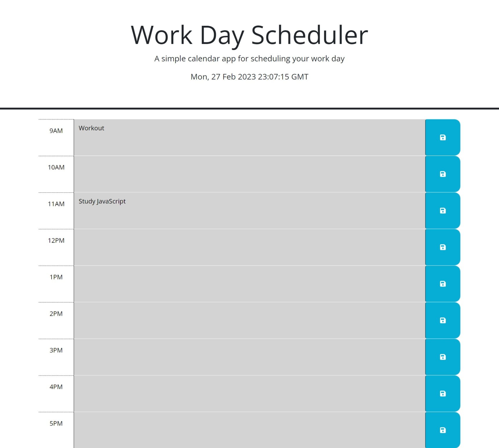

# 05 Third-Party APIs: Work Day Scheduler

## Your Task

Application is a work day calender setup hourly. Project uses DayJs, JavaScript, and Bootstrap in order to use application. 

## ScreenShot

## Links

